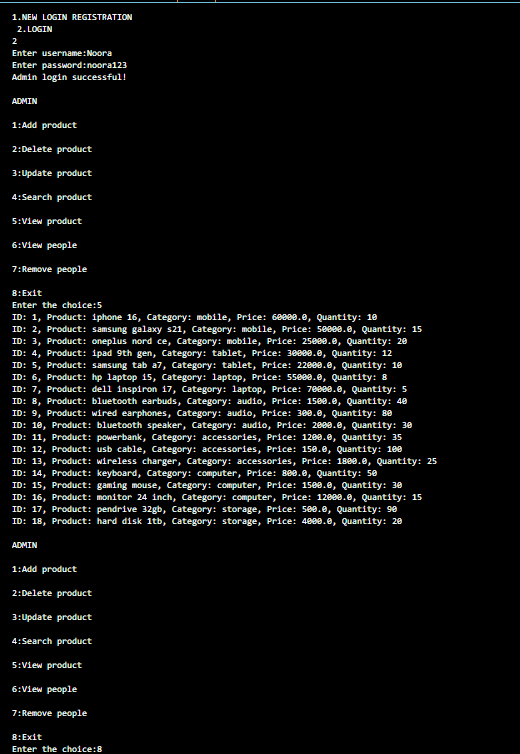
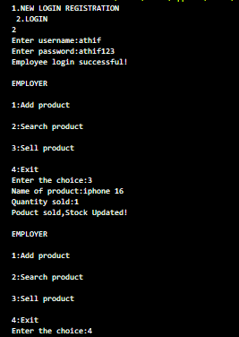
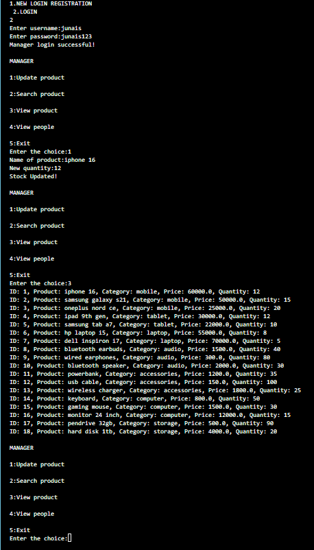
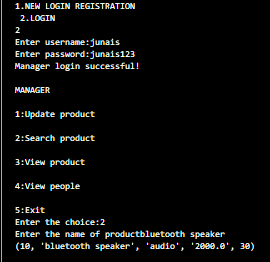
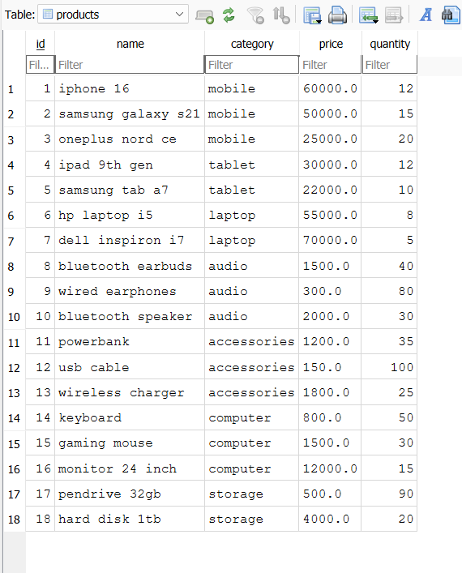
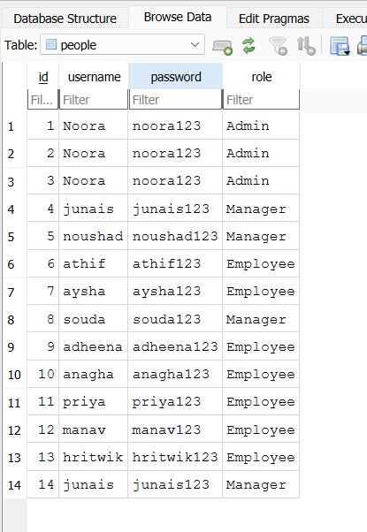

# inventory_management_system
Python+SQLite Inventory management system
[Inventory Management System.pdf](https://github.com/user-attachments/files/26094210/Inventory.Management.System.pdf)

📸 Screenshots
👑 Admin – View Product List
Shows the admin successfully logged in and viewing all available products in the inventory.

👷 Employee – Sell Product
Demonstrates an employee selling a product and updating the stock quantity.

🧑‍💼 Manager – Update Stock
Shows the manager updating the quantity of an existing product.

🔍 Manager – Search Product
Displays the search functionality where a manager looks up a product by name.

🗄️ Database – Products Table
SQLite database table showing stored product details such as name, category, price, and quantity.

👥 Database – Users Table
SQLite database table displaying registered users with their roles (Admin, Manager, Employee).

